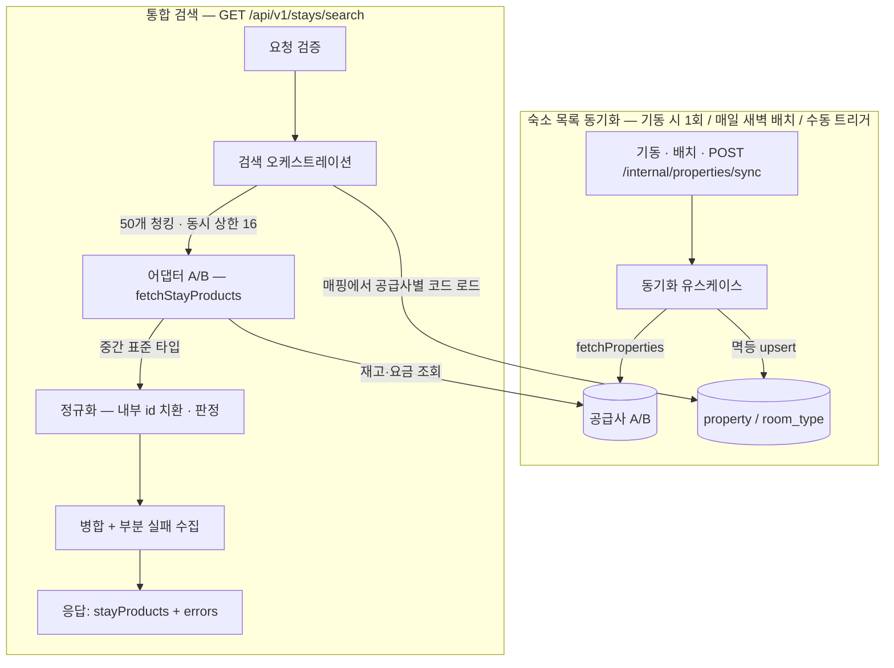

# 아키텍처

여러 공급사의 서로 다른 API를 하나의 표준 모델로 통합하되, 공급사별 형식이 안쪽 계층으로 새어 나가지 않게
경계를 긋는 것이 이 아키텍처의 중심 관심사입니다. 의존성 방향의 일반 원칙(단방향·순환 금지·DIP)은
`CLAUDE.md`에 있고, 이 문서는 그 원칙을 이 프로젝트의 구체 구조로 옮긴 결과입니다. 결정 과정의 상세한
흐름은 `JOURNAL.md`에 있습니다.

## 레이어와 패키지 — 기능 레이어 슬라이스

```
com.staysync
├── web/        표현 — 컨트롤러, 요청 검증, 응답 DTO, 예외 핸들러
├── search/     유스케이스 — 통합 검색 오케스트레이션(병렬 조회·정규화·병합)
├── sync/       유스케이스 — 숙소 목록 동기화(매핑 upsert)
├── supplier/   경계 — 포트 인터페이스(SupplierClient) + 공급사별 어댑터(a/, b/)
├── domain/     안쪽 — 표준 모델(model), 엔티티(entity), 리포지토리(repository)
└── config/     횡단 — WebClient·타임아웃 설정 등
```

의존은 `web → search·sync → (supplier 포트 / domain)`으로만 흐르고, 어댑터는 포트의 구현으로 바깥에
위치합니다. 이 프로젝트는 도메인이 사실상 하나(숙박 검색)라, 유스케이스 두 개(검색·동기화)를 패키지로
나누는 이 수준이 구조와 규모에 맞습니다 — DDD 4계층은 여러 바운디드 컨텍스트가 있을 때 빛나는 구조라
도메인 하나에는 의식(ceremony)이 되고, 헥사고날 디렉토리 표기는 개념을 이미 따르므로 실익이 없습니다.
도메인이 늘어나 컨텍스트 분리가 필요해지면 그때 명시적 진화로 재편합니다.

## 어댑터 경계 — 두 단계 변환

핵심 질문은 "어댑터가 무엇을 반환하는가"였습니다. 어댑터가 도메인 `StayProduct`를 직접 만드는 것은
불가능하고 불가능해야 합니다 — `StayProduct`의 내부 식별자는 DB 매핑에서 나오는데, 어댑터가 그것을 알려면
DB에 의존해야 하고 그 순간 "외부 형식 변환"이라는 단일 책임이 무너집니다. 그래서 경계는 두 단계 변환입니다.

```
공급사 원시 응답 ──(어댑터: 형식 통일)──▶ 중간 표준 타입 ──(정규화: 도메인화)──▶ StayProduct
     A/B 제각각              공급사 코드 기반, 형식은 동일           내부 id + 판정 결과
```

- **포트 `SupplierClient`** (supplier 패키지) — 메서드는 `fetchProperties()`(숙소 목록)와
  `fetchStayProducts(조건)`(재고·요금) 둘입니다. 실패를 통일한 공통 예외(+retryable 분류)도 포트 계약의
  일부로 supplier 패키지가 소유합니다.
- **중간 표준 타입** (supplier 패키지) — 공급사 코드를 그대로 쓰되 형식은 통일된 타입 두 벌: 숙소
  목록용(코드·이름·정원)과 재고·요금용(코드 + gross 총액 + 날짜별 잔여 + 실측 일자별 금액 + 조식). 원시
  DTO는 `supplier/a`·`supplier/b` 안에 갇혀 이 타입으로만 나옵니다.
- **정규화** (search 유스케이스의 컴포넌트) — 중간 타입을 받아 매핑으로 내부 id를 치환하고, 가용성
  판정(병목 최소값·엄격·3상태)과 평균 1박가(내림) 계산을 거쳐 `StayProduct`를 만듭니다. 판정 규칙 자체는
  공급사 지식이 아닌 도메인 정책이므로 순수 함수로 domain에 두고 정규화가 호출합니다 — Spring 없이 단위
  테스트되는 위치입니다.

이 구조의 검증 기준은 신규 공급사 추가 런북([INTEGRATION.md](INTEGRATION.md))과 같습니다 — 공급사 C를
추가할 때 중간 표준 타입과 정규화는 한 글자도 바뀌지 않아야 합니다.

## 핵심 흐름



### 동기화 흐름의 규칙

검색은 매핑을 전제로 하므로(재고·요금 조회가 숙소 코드 목록을 요구), 숙소 목록을 미리 받아 매핑으로 저장해
둡니다. 시점은 세 경로의 조합입니다 — **기동 시 1회**(첫 검색 전 준비. 단, 동기화 실패가 기동을 막지
않습니다 — 매핑이 비면 빈 결과를 줄 뿐이고, 앱이 떠 있어야 복구 경로가 삽니다), **매일 새벽 주기
배치**(자주 안 바뀌는 데이터의 신선도 유지, 주기는 외부화), **수동 트리거**(공급사의 변경 통보 시 즉시
갱신). 운영 규칙 두 가지 — 공급사별 실패 격리(A 실패가 B 동기화를 막지 않음), 동시 실행 직렬화(세 경로가
겹치면 upsert의 UNIQUE 경합이 생기므로 동기화는 한 번에 하나만).

### 검색 흐름의 규칙

요청 검증(400 규칙은 [API.md](API.md)) → 매핑에서 공급사별 코드 로드 → 50개 청킹·동시 상한 16으로 병렬
조회 → 어댑터가 형식을 통일하고 정규화가 도메인화 → 병합. 한 공급사가 실패해도 나머지 결과로 응답하고 실패
사실은 `errors`로 드러납니다. 타임아웃·부분 실패의 정책은 [INTEGRATION.md](INTEGRATION.md)를 참고하세요.

## Mock 공급사 — 실행형, 별도 포트

견고성은 정상 응답만으로 증명할 수 없으므로, Mock은 세 상황을 재현합니다 — 정상 / 공급사 장애(A는 HTTP
503, B는 HTTP 200 + `resultCode` E503) / 무응답. 구성은 **실행형 Mock 서버**입니다.

- 같은 저장소의 **별도 Gradle 모듈**(`mock-supplier`)로 두어, 본 앱 아티팩트에 Mock 코드가 실리지 않고
  의존성도 섞이지 않습니다(웹 스타터만 의존 — DB 없이 단독 기동). 별도 앱으로 기동합니다.
- **반드시 별도 포트로 띄웁니다.** 같은 프로세스에 두면 앱이 자기 자신을 HTTP로 호출하면서 서버 스레드가
  묶여, 연동 문제로 오해하기 쉬운 가짜 실패가 생깁니다 — 구조적 함정입니다.
- 공급사별 **모드 전환 엔드포인트**(normal / error / no-response)로 실행 중에 장애를 주입합니다. 응답
  데이터는 고정 수준으로 최소화합니다 — Mock의 코드 품질에 시간을 쓰지 않습니다.
- 자동 테스트용 mock은 별개 용도(회귀 고정)로, 테스트 도구 논의 때 확정합니다.
