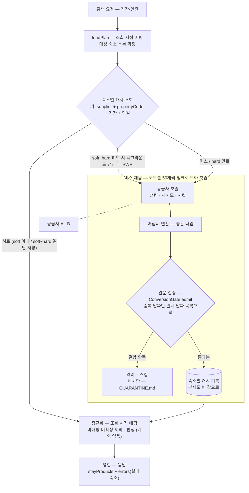

# 요금·재고 캐시 전략 (설계 — 구현은 전환 트리거 발동 시)

이 문서는 캐시의 **흐름 설계만** 담습니다. 현 규모(공급사당 청크 1개, 응답 수십 ms)에서는 캐시의 이득이
없고 신선도 비용만 생기므로 구현하지 않으며, [INTEGRATION.md](INTEGRATION.md)의 전환 트리거 — **검색
p95 초과 또는 429 관측**(`rate_limited` outcome 지표로 관측 가능) — 가 발동하면 이 설계대로 도입합니다.

**원칙과의 관계.** 이 저장소는 "요금·재고는 저장하지 않는다"([ERD.md](ERD.md))를 원칙으로 삼습니다.
캐시는 이 원칙의 명시적 완화입니다 — 다만 영속 저장이 아니라 수 분짜리 스냅샷 보관이고, 진실의 원천은
여전히 공급사 실시간 응답입니다. 완화의 범위를 아래 TTL(정합성 오차 허용 범위)로 수치화합니다.

## 무엇을, 어떤 단위로

```
공급사 원시 응답 ──(어댑터: 형식 통일)──▶ 중간 표준 타입 ──(정규화: 매핑 치환·판정)──▶ StayProduct
                                          ↑ 캐시는 여기 (정규화 전)
```

키는 **숙소 단위**입니다 — `(supplier, propertyCode, checkIn, checkOut, adults, children)`, 예
`A:C0417:2026-09-01:2026-09-04:2:1`. 검색 한 건이 공급사 × 숙소 수만큼의 키를 조회하고, 미스난 숙소만
청크(50개)로 모아 호출해 채웁니다. 로컬(Caffeine)에서는 문자열이 아니라 data class 자체를 키로 쓰고
(equals/hashCode), Redis 전환 시 `stay:v1:A:…` 처럼 값 스키마 버전 접두사를 붙인 문자열로 직렬화합니다.

> **소규모 축약** — 청크가 1~2개인 초기에는 `(supplier, checkIn, checkOut, adults, children)` 요청 단위로
> 접어도 됩니다. 전량 검색이라 한 공급사의 숙소들이 같은 fetch 에서 함께 태어나 함께 만료되므로, 숙소별로
> 쪼개도 동작이 같고 장부만 늘기 때문입니다. 부분 상태(부분 실패·신규 편입)가 일상이 되는 규모부터 숙소
> 단위로 펼칩니다(→ "규모별 거동" 절).

- **키의 축**: 각 축은 두 조건을 만족해야 합니다 — ① 원본 응답이 그 축의 함수이고(빠뜨리면 오답),
  ② 우리가 요청 입력으로 지정할 수 있다(없으면 미스를 채울 수 없음). **propertyCode·기간·인원**은 셋 다
  만족합니다(호출이 `숙소 코드 묶음 × 기간 × 인원`이라 전부 요청 입력, 인원은 아동 요금 차등 등으로 응답을
  바꿀 수 있음 — 계약 기준이라 지금 원본이 인원을 무시해도 키에 둔다). **룸타입은 축이 아닙니다** — 요청에
  없는 응답의 출력(항목 식별자)이라 ②를 못 만족해, 키에 넣어도 그 미스를 지정해 채울 수 없습니다.
- **기간은 통짜 축**: 일자로 쪼개면 겹침 재사용(9/1~4 와 9/2~5 가 9/2~4 공유)이 생기지만, B 의 요금이
  기간 총액이라 일자 분해가 계약적으로 불가능하고 원본 호출도 기간 단위라 일자 미스를 못 채웁니다. 키는
  호출 축을 그대로 따릅니다.
- **값**: 그 숙소의 **중간 표준 타입**(`SupplierStayProduct`) — 어댑터 변환은 끝났지만 정규화 전 상태.
- **정규화 전에 캐시하는 이유**: 정규화(내부 id 치환·가용성 판정)는 캐시를 읽은 뒤 조회 시점의 매핑으로
  매번 수행됩니다. 그래서 **동기화가 매핑을 갱신해도 캐시 무효화가 필요 없고**, 가용성 판정 규칙이
  바뀌어도 다음 조회부터 새 정책으로 판정됩니다. 원칙은 "**바뀔 수 있는 것(매핑·판정)은 굽지 않고, 안
  바뀌는 것(결정적 변환)만 굽는다**" — 같은 이유로 어댑터 앞(원시 응답)도 아닙니다(변환은 결정적이라
  미뤄서 얻는 것이 없고, wire 형식이 캐시에 스미며 변환 CPU 를 히트마다 다시 지불).
- **오염 통로가 아닌 이유**: 저장 형태는 정규화 전이지만 **기록의 입장 검사는 변환·검증 통과**(격리 관문,
  [QUARANTINE.md](QUARANTINE.md))입니다. 쓰기 경로가 `호출 → 변환 → 관문 검증(결함은 격리·스킵) → 캐시
  기록 → (읽기 시점) 정규화`라 결함은 캐시 앞에서 걸러집니다. 검증을 통과하는 오염(그럴싸하게 틀린 값)은
  캐시가 없어도 서빙되는 것으로, 캐시는 노출을 최대 hard TTL 만큼 연장할 뿐입니다.
- **공급사별로 나뉘는 이유**: 부분 실패와의 궁합 — 성공한 공급사·숙소만 캐시되고, 실패는 캐시를
  오염시키지 않으며 다음 검색에서 그 숙소만 재호출됩니다.

## 흐름



- **정규화의 위치**: 히트든 미스든 **캐시 뒤(읽기 시점)**입니다 — 결함 차단은 정규화가 아니라 캐시 앞의
  관문 몫이고, 매핑·판정은 조회 시점 것으로 매번 새로 적용됩니다.
- **부분 실패 내성**: 직전 fetch 에서 성공한 숙소는 공급사가 지금 장애여도 **hard TTL 안이라면**
  서빙되고, 재호출은 실패분 청크로 좁혀집니다. 요청 단위 값의 "부분 실패 시 통째 미기록 vs 조용한 부분
  서빙" 딜레마가 숙소 단위에서 사라집니다.
- **stale-if-error 와의 경계**: 이 서빙은 hard TTL **안**의 정상 캐시가 장애를 우연히 가리는 것입니다.
  TTL 을 넘긴 연장 서빙은 하지 않습니다(아래 별도 절) — 지나면 그 숙소는 결측이 되어 `errors` 로 드러납니다.
- 원본 조회 경로는 지금과 동일합니다 — 캐시는 앞단의 단기 스냅샷 층일 뿐 회복탄력성·계측을 바꾸지
  않습니다(히트는 공급사 호출이 아니라 `supplier.stayproducts.fetch` 에 안 잡히고, 도입 시 히트율 카운터를
  별도 추가).

## 저장소 — Caffeine, 확장 시 Redis

단일 인스턴스인 현 구조에서는 로컬 캐시(Caffeine)로 시작합니다 — 네트워크 왕복 없는 조회, 요청
결합(single-flight)과 백그라운드 갱신(`refreshAfterWrite`)을 라이브러리가 기본 제공합니다. **다중
인스턴스로 확장하면 Redis 같은 분산 캐시가 필요합니다** — 인스턴스마다 캐시가 갈리면 히트율이 인스턴스
수만큼 나빠지고 갱신 폭주(각자 미스)가 생기기 때문이며, 그 시점에는 분산 락 또는 확률적 조기 만료를 함께
재검토합니다.

## TTL — soft 3분 / hard 10분 (정합성 오차 허용 범위)

이중 TTL(stale-while-revalidate)을 씁니다.

- **soft 3분**: 넘으면 이전 값을 서빙하면서 백그라운드로 1회만 갱신합니다. 트래픽이 있는 키는 사실상
  3분 이내 신선도를 유지합니다.
- **hard 10분**: 넘으면 만료 — 원본을 기다립니다. 즉 **표시가 낡을 수 있는 최대 폭은 10분**이고, 이것이
  "캐시와 원본의 정합성 오차 허용 범위"의 선언입니다.

**수치 결정의 핵심은 "왜 캐시를 켜는가"와 정합해야 한다는 것입니다.** 캐시 도입 트리거는 검색 p95 초과
또는 429 관측 — 곧 **공급사 호출량**입니다. 그런데 soft 를 짧게 잡으면(예: 60초) 트래픽 있는 키를 그
주기마다 백그라운드 재검증해 공급사를 계속 두드리므로, **호출 절감이라는 도입 목적을 스스로 갉아먹습니다.**
그래서 soft 는 신선도의 명분으로 무작정 조이지 않고, 호출 절감이 실제로 나오는 수 분 단위(3분)로 둡니다.

낡은 표시의 위험은 오버부킹이 아니라 표시 품질(바운스)뿐입니다 — **오버부킹의 최종 방어선은 예약 단계의
재확인**이라 검색 캐시의 신선도가 안전 장치가 아니기 때문입니다(아래 전제). 그래서 hard 를 5분에서 10분
으로 늘려도 안전 축이 아니라 표시 품질 축에서만 대가를 치릅니다.

**가격과 재고에 하나의 TTL 을 함께 씁니다** — 상품(`SupplierStayProduct`)을 통째로 캐시하므로 값을 쪼개
가격·재고에 다른 TTL 을 주지 않습니다. 재고가 가격보다 빨리 변해 더 조인 TTL 을 요구할 법하지만,
**재고의 정확성은 캐시가 아니라 예약 단계 재확인이 보장**하므로 캐시에서 재고를 특별히 조일 이유가
없습니다. 그래서 이 정합성 오차 허용 범위는 정확성 예산이 아니라 표시 품질 예산이고, 하나의 TTL 로
충분합니다(값 단위로 TTL 을 쪼개는 것은 캐시 값 분할을 동반해 현 규모에 과설계입니다).

업계 수치와의 관계를 정확히 둡니다 — OTA 실무의 "검색 결과 캐시 ~5분", "예약 직전 부킹 패널 ~10분 후
최종 재검증"은 **서로 다른 두 캐시 층의 각각의 수명**이지 한 캐시의 soft/hard 가 아닙니다. 우리는 그 두
숫자를 soft/hard 로 그대로 옮기지 않고, 검색 결과 층(~5분) 안쪽에 soft(3분)를 두어 실효 신선도를 확보하고,
부킹 패널 층(~10분)을 hard 상한으로 삼아 최대 오차를 봉합니다. 메타서치(Google Hotel)의 "캐시 가격은
허용하되 최종 페이지 가격과 일치해야 한다"는 검증 전제도 같은 구조입니다. 전제 하나를 명시합니다 —
**오버부킹의 최종 방어선은 예약 단계의 재확인**입니다(검색 응답은 캐시가 없어도 조회 시점의 스냅샷일 뿐,
예약을 보장하지 않습니다). 예약 흐름은 현재 비범위이므로, 도입 시 "예약 직전 실시간 재조회 + 예약 완료
이벤트로 해당 숙소 키 무효화"를 추가합니다 — 키가 숙소 단위라 예약된 숙소의 키만 지우면 됩니다(요청 단위
축약형이었다면 값에 여러 숙소가 섞여 태그 기반 선별 삭제가 필요합니다).

값은 출발점입니다 — 업계처럼 수요 연동 조정(성수기·잔여 소량·당일 검색은 단축)이 다음 단계이고, 조정의
근거는 지표(히트율, 캐시 나이 분포, `rate_limited` 빈도)입니다. 구체적 축은 **체크인 임박도**입니다 —
임박할수록 재고 변동이 빨라 TTL 을 계단식으로 줄입니다(Skyscanner 는 출발 1개월 밖 8시간 → 1주 내
1시간으로 운용). 우리 스케일(soft 3분)에서는 "체크인 3일 내는 soft 를 90초로 절반" 같은 형태가 됩니다.

## 규모별 거동과 단위 전환

키가 숙소 단위인 것은 규모의 함수입니다. 전략별 산술(상품 1건의 중간 타입 ~0.3–1KB, 청크당 50개):

| 캐시 단위 | 수천 (5,000) | 수만 (50,000) |
|---|---|---|
| **요청 단위** (소규모 축약형) | 유효하나 경계 — 값 ~1.5–5MB/키, 갱신 1회 = ⌈N/50⌉ = 100호출 | **깨짐** — 값 15–50MB/키, 갱신 1회 = 1,000호출. 인기 키 몇 개의 soft 갱신만으로 상시 분당 수만 호출 — **캐시 갱신이 429 의 원인**이 된다 |
| **숙소 단위** (기본형) | 유효 — 값 크기 상수, 미스 부분화(부분 실패 후엔 실패 청크만, 신규 숙소는 그 숙소만 재호출), 갱신 분산 | 유효 — 총 데이터가 커져 Redis 전환과 자연히 동행 |
| **상품 단위** (숙소·객실) | 과설계 | 검색 1건 = 수만 키 멀티겟 + **키 부재가 "미스"인지 "그 기간 상품 없음"인지 구분 불가**. 미스 개념이 없는 **스냅샷(2단계)의 저장 단위로는 표준** |

**입도가 줄이는 것은 호출 총량이 아니라 재호출 범위입니다.** 전량 검색에서는 한 공급사의 항목들이 같은
fetch 에서 함께 만료되므로 미스도 전량 동시이고, 호출 총량은 (기간×인원 조합의 다양성) × (TTL 경과)가
정합니다. 숙소 단위의 이득은 항목들의 **시각이 어긋날 때** 나옵니다 — 부분 실패·신규 편입·부분 조회.
그래서 청크 1~2개(부분 상태가 드묾)에서는 요청 단위 축약형과 호출수가 같아 단순함이 이기고, 청크가
수십~백 개(수천 개 언저리)가 되면 갈라집니다 — 호출당 실패율 1%에 청크 100개면 전량 fetch 의
1 − 0.99¹⁰⁰ ≈ **63%가 최소 1청크 실패**라, "실패 후 전량 재조회(100호출) vs 실패분만 재조회(수 호출)"의
차이가 커집니다. **전환 기준은 규모 숫자가 아니라 부분 상태의 빈도**입니다.

전환 경로는 **요청 단위 축약 → 숙소 단위 → 스냅샷**([INTEGRATION.md](INTEGRATION.md) 로드맵 2단계 —
검색 지연이 N 과 무관해지는 근본 해법)입니다. 계약이 부분 조회(페이징·일부 숙소·일부 룸타입)로 진화하면
지금은 출력이던 축이 요청 입력이 되므로 키를 그 호출 단위로 다시 가져가고, 그때는 재호출 범위만이 아니라
**API 호출 수 자체가** 줄어듭니다. 수만 규모에선 캐시와 무관한 문제도 옵니다 — 상품 수만 개를 한 응답에
담으면 payload 가 수십 MB 라, 비범위로 미뤄 둔 페이징·정렬의 재론이 불가피합니다.

## 캐시 스탬피드 방지 — 계층화

인기 키가 만료되는 순간 동시 요청이 전부 원본으로 몰리는 문제(thundering herd)에는 실무 표준인
계층화로 대응합니다.

| 층 | 수단 | 도입 시 적용 |
|---|---|---|
| 기본 | **stale-while-revalidate** (soft/hard 이중 TTL) | 만료 절벽 자체를 제거 — `refreshAfterWrite` |
| 기본 | **요청 결합(single-flight)** | 같은 키의 동시 적재를 1회로 — Caffeine 로딩 캐시 기본 동작 |
| 콜드 미스 | 위 둘로 충분 (로컬 캐시라 인스턴스 내 결합이 완결) | — |
| Redis 전환 시 | **분산 락** 또는 **확률적 조기 만료**(만료 전 확률적 갱신 — 락 없이 동작) | 전환 시점에 선택 |
| 선택 | **사전 예열(pre-warm)** — 첫 요청 전에 인기 키를 미리 적재 | 로컬 캐시는 재기동마다 증발하므로 배포 직후 콜드 스타트 완화용. 무엇을 미리 로드할지는 **선정 기준**이 정한다 — 체크인이 임박하거나 최근 조회가 잦은 키를 우선, 데이터가 쌓이면 머신러닝으로 "곧 조회될 조합"을 예측해 적재(AltexSoft 의 FareBoom 사례) |
| 미채택 | **자발적 갱신(proactive refresh)** — 요청 없이 타이머로 갱신 | SWR 이 트래픽 있는 키를 이미 커버 — 안 보는 키까지 갱신하는 호출 낭비만 남는다 |

이 수단들은 "갱신의 주도권"이 다를 뿐 하나의 스펙트럼입니다 — **반응형 적재(요청 시) → SWR(요청이 갱신
유도) → 자발적 갱신(타이머) → 사전 예열(요청 전 적재) → 스냅샷(전부 상시 보유)**. 오른쪽으로 갈수록
신선도·지연은 좋아지고 공급사 호출량·저장 부담이 커집니다. 우리 설계는 왼쪽 두 칸에 있고, 규모 절의
전환 경로는 곧 이 스펙트럼 위를 오른쪽으로 이동하는 일입니다.

## 캐시하지 않는 것

- **실패 응답** — 네거티브 캐시 금지. 실패의 처리(재시도·서킷·부분 실패)는 회복탄력성 계층의 소관이고,
  실패를 캐시하면 회복된 공급사가 TTL 동안 계속 죽은 것처럼 보입니다.
- **변환·검증에서 걸린 결함 항목** — 격리([QUARANTINE.md](QUARANTINE.md))로 빠지며 캐시에 기록하지
  않습니다(결함을 캐시하면 같은 실패가 TTL 동안 반복). 단, **실패와 제외를 구분합니다** — 미매핑으로
  응답에서 빠진 상품(resolve 미스 → 스킵)은 결함이 아니라 "지금 매핑 기준으로 안 보이는 상품"이므로 중간
  타입 원자료를 캐시에 남깁니다. 기록 시점 매핑으로 필터해 담으면 캐시가 그 시점 매핑의 함수가 되어 정규화
  전 캐시의 이득(매핑 추가 시 재조회 없이 노출되는 자가 치유)이 사라지기 때문입니다.
- **숙소 목록** — 이미 DB 매핑이 그 역할을 합니다(정적 콘텐츠의 사전 저장, [ERD.md](ERD.md)).

## 서킷 open 시의 연장 서빙(stale-if-error) — 검토 후 비채택

서킷이 차단한 공급사의 마지막 성공 결과를 TTL 을 넘겨 계속 서빙하는 방안은 **채택하지 않습니다.**
장애가 길어지면 캐시와 실제 재고의 괴리를 확인할 방법 자체가 없어지고, "확실하지 않으면 팔지 않는다"는
가용성 판정의 보수 원칙([DOMAIN_MODEL.md](DOMAIN_MODEL.md))과 정면으로 충돌합니다 — 장애로 검증
불가능해진 낡은 재고를 파는 것은 미확정 상품을 파는 것과 같은 위험(오버부킹은 고객 피해)입니다. 차단
사실은 이미 `errors[].reason: "circuit open"`으로 정직하게 드러납니다.

## 리서치 기록

TTL 수치·스탬피드 수단·규모 대응은 아래 조사에 근거합니다 — 어떤 발견이 어떤 결정으로 이어졌는지 함께 남깁니다.

- **OTA 캐싱 관행** ([AltexSoft — Caching Strategies in OTAs](https://www.altexsoft.com/blog/ota-caching-strategies/)):
  검색 결과 캐시는 대체로 **~5분**, 정적 콘텐츠(사진·시설)는 24–48시간, 예약 직전 단계(부킹 패널)는
  **~10분 캐시 후 최종 재검증**, 예약 완료 이벤트로 해당 재고 즉시 무효화, 그리고 성수기·잔여 소량·당일
  검색에서는 TTL 을 단축하는 수요 연동 조정이 일반적(이 ~5분·~10분은 서로 다른 두 캐시 층의 수명이지 한 캐시의 soft/hard 가 아니다 — TTL 절 참조). → **검색 층 ~5분 안쪽 soft 3분 / 부킹 패널 ~10분 hard 상한**, "예약 시점 재확인 + 이벤트
  무효화는 예약 흐름 도입 시 추가", "수요 연동 조정은 지표 후 다음 단계"의 근거.
  전체 정독에서 추가로 얻은 것: ① 수요 연동의 구체 축은 **임박도 계단**이다(Skyscanner: 출발 1개월 밖
  8시간 → 1주 내 1시간 — TTL 절의 "체크인 임박도" 서술의 근거). ② 무효화는 **태그 기반**이 표준이다 —
  항목에 숙소 id 태그를 달아 영향받은 항목만 선별 삭제. ③ 캐시의 동기에는 지연 외에 **공급사 호출
  비용**이 있다 — Look-to-Book 비율이 나쁘면 공급사가 요금·제한을 걸어오므로, 캐시는 관계 유지
  수단이기도 하다(전환 트리거에 429 관측을 둔 판단의 업계 배경). ④ 정확도 요구는 **여정 단계의
  그라데이션**이다 — 발견 페이지(예측치 허용) → 목록(주의) → 결제 직전(불허). 우리 "표시가는 최대 10분
  낡되 예약 단계 재확인" 전제가 이 그라데이션의 한 단면. ⑤ 규모 사례: Amadeus 는 2계층(인메모리 +
  Couchbase) 캐시로 히트율 ~85%를 유지하며 평시의 50배 트래픽 피크를 감당한다 — Caffeine→Redis
  2계층 경로의 선례.
- **메타서치의 가격 정확도 정책** ([Google Hotel Center — Price Accuracy](https://support.google.com/hotelprices/answer/6064419?hl=en),
  [Improve Price Accuracy](https://support.google.com/hotelprices/answer/6069469?hl=en)): 캐시된 가격의
  노출을 허용하되 최종 예약 페이지의 가격과 일치해야 하고, 불일치는 캐시 갱신으로 교정한다. → "캐시는
  허용하되 최종 단계에서 검증한다"는 업계 전제의 선례 — 우리의 "오버부킹 방어선은 예약 단계 재확인"
  전제와 같은 구조.
- **유통 모델의 규모 해법 — 우리 쪽 저장과 델타 갱신** ([Channex — Push and Pull](https://medium.com/channex/hotel-distribution-push-and-pull-and-what-is-the-best-approach-bf4f7434b4aa),
  [Hospitality Net — Push/Pull Models](https://www.hospitalitynet.org/opinion/4063892.html)): OTA 는 분당
  수백만 검색을 원천 시스템에 실시간으로 물을 수 없어 ARI(가용성·요금·재고) **사본을 자기 쪽에
  저장**하고, 전체 달력 대신 **변경분(델타)만** 주고받는 것이 유통 업계의 표준 구조다. 사전 저장(push)은
  예약 시점 부정확 리스크를, 실시간 조회(pull)는 원천 부하를 각각 대가로 치른다. → 전환 경로의 종착점을
  스냅샷([INTEGRATION.md](INTEGRATION.md) 로드맵 2단계)으로 둔 판단과, "정확도의 최종 방어선은 예약 단계
  재확인"이라는 전제의 근거.
- **메타서치의 규모별 전달 방식** ([Google Hotel Prices — Delivery Modes](https://developers.google.com/hotels/hotel-prices/dev-guide/delivery-mode)):
  숙소가 많을수록 정확도 유지를 위해 주고받아야 할 데이터가 커지므로, 대규모 파트너에는 전량이 아니라
  **변경된 숙소만 선별 질의하는 Changed Pricing** 을 권장한다. → "전량 재조회형 갱신은 규모에서
  깨진다"는 규모 절의 갱신 비용 산술과 같은 문제 인식 — 해법도 같은 방향(변경분만)이다.
- **자체 저장 전제의 캐시 단위** ([Hotel Search System Design](https://dev.to/sumedhbala/hotel-search-system-design-5ea4),
  [AcquaintSoft — How Hotel Booking Engines Work](https://acquaintsoft.com/blog/how-hotel-booking-engines-work)):
  스냅샷을 전제한 설계에서는 가용성 키가 `hotel_id:room_type` + 날짜 필드의 **상품×날짜 미세 단위**이고,
  검색은 CDC 파이프라인으로 사전 수집된 인덱스가 담당하며, 가용성 층은 60–120초 주기로 갱신하고 라이브
  조회는 예약(체크아웃) 시점에만 한다. → 상품 단위 미세 키는 **스냅샷(2단계)의 저장 단위**로는
  표준이지만 원격 pull 앞단 캐시 단위로는 아니라는, 규모 절 단위 표의 기각 판단의 적용 범위를 한정하는
  근거. soft 3분과도 정합한다.
- **스탬피드 방지의 실무 표준** ([Cloudflare — lock-free probabilistic caching](https://blog.cloudflare.com/sometimes-i-cache/),
  [OneUptime — Cache Stampede Prevention](https://oneuptime.com/blog/post/2026-01-30-cache-stampede-prevention/view)):
  견고한 시스템은 수단을 계층화한다 — 핫 키 사전 갱신 + stale-while-revalidate 기본 + 콜드 미스 락.
  락 없이 동작하는 확률적 조기 만료(만료가 가까울수록 높은 확률로 미리 갱신)는 SWR 을 못 쓰는 환경의
  대안. → 스탬피드 절의 계층화 표와 "Redis 전환 시 분산 락 또는 확률적 조기 만료" 선택지의 근거.
