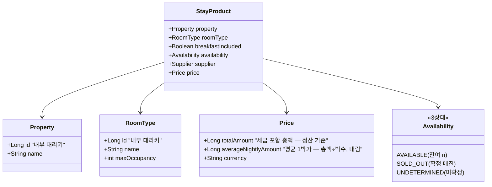

# 통합 숙박 상품 모델

공급사들은 같은 "숙박 상품"을 서로 다른 방식으로 표현합니다. 이 문서는 그 차이를 흡수하는 표준 모델을
어떤 단위로 잡았고, 무엇을 표준으로 삼고 무엇을 버렸으며, 그 근거가 무엇인지 설명합니다. 결정 과정의
상세한 흐름은 `JOURNAL.md`에 있습니다.

## 설계 원칙 — 교집합, 그리고 명시적 진화

표준 모델에는 공급사들이 **공통으로 채울 수 있는 정보(교집합)만** 담는 것을 원칙으로 합니다. 한쪽 공급사만
주는 정보를 nullable 필드로 들이면 필드가 출처에 따라 채워지거나 비어, 소비자가 결국 공급사별 분기를 하게
됩니다 — 통합 모델의 목적이 모델 표면에서 무너지는 셈입니다.

이 원칙의 더 근본적인 근거는 확장성입니다. 지금은 공급사가 둘이라 어긋나는 필드가 사실상 하나(요금
표현)지만, 공급사가 늘수록 공급사 고유 필드도 늘어나므로 모든 필드를 다 가져오는 것은 결국 불가능해집니다.
교집합만이 공급사 수에 대해 확장 가능한 원칙입니다.

다만 교집합은 출발점이지 감옥이 아닙니다 — **필요가 생기면 공통 모델을 명시적으로 변경**하며, 그 변경은
원칙의 예외임을 문서에 남깁니다. 현재 예외는 없습니다 — 한 차례 도입했던 예외(일자별 실측 금액)는
소비자 분기 부담을 근거로 되돌렸으며, 그 경위는 아래 "잃는 것" 목록과 JOURNAL 에 있습니다.

## 상품 단위 — 숙소 × 객실 타입

두 공급사 모두 상품을 `숙소 > 객실 타입` 2단계로 표현하고 요금과 재고를 객실 타입 단위로 줍니다(개별 물리
객실은 노출하지 않음). 우리가 단위를 발명할 여지가 없는 주어진 구조라, 표준 상품의 최소 단위도 **숙소 ×
객실 타입**으로 따라갑니다.

`StayProduct`는 숙박 상품의 단위로, 검색 때마다 어댑터 응답을 정규화해 만드는 런타임 모델이며
영속화하지 않습니다 — 특정 검색 조건(날짜·인원)에서의 요금과 가용성이 붙은 판매 상품 하나가 검색 결과의
항목입니다. 저장하는 것은 식별자 매핑뿐입니다(ERD 문서 참고).

## 표준 모델의 네 단위 — 숙소·객실·요금·재고

네 개념은 각각 독립된 비영속 모델로 정의되고, `StayProduct`가 이들을 조합해 검색 결과 항목이 됩니다.

| 개념 | 단위 정의 | 비영속 모델 | 영속 표현 (ERD) |
|---|---|---|---|
| 숙소 | 공급사 안에서만 유일한 코드에 내부 대리키를 부여한 단위 | `Property` (id, name) | `property` 매핑 테이블 |
| 객실 | 개별 물리 객실이 아니라 **객실 타입** — 숙소 안에서만 유일 | `RoomType` (id, name, maxOccupancy) | `room_type` 매핑 테이블 |
| 요금 | 숙박 기간 전체의 **세금 포함 총액** 기준 묶음 | `Price` | 저장하지 않음 |
| 재고 | 날짜별 잔여 수를 전 기간 병목으로 판정한 결과 | `Availability` 3상태 | 저장하지 않음 |

숙소·객실의 비영속 모델은 매핑 엔티티의 **투영**입니다 — 검색 결과에 필요한 것은 내부 식별자와 표시
속성뿐이라, 정규화가 매핑에서 이 형태로 만들어 상품에 싣습니다. 공급사 코드는 여기에 없습니다(어댑터
경계 밖으로 나오지 않는 원칙). API 응답에서는 이 중첩 구조를 평면(`propertyId`, `propertyName`, ...)으로
투영합니다 — 표현 계층의 변환이며 계약은 [API.md](API.md)가 기준입니다.

## 요금 — 총액이 기준, 1박가는 함께

두 공급사의 요금 표현은 정면으로 어긋납니다.

| | 공급사 A | 공급사 B |
|---|---|---|
| 단위 | 날짜별 1박 단가 | 기간 전체 총액 |
| 세금 | 별도(단가 + 세금액 분리) | 포함(금액 분리 없음) |

A의 날짜별 net+세금은 합산하면 세금 포함 총액이 되지만, B의 총액에서 날짜별 단가나 세금액을 복원하는 것은
정보가 없어 불가능합니다. 두 공급사가 공통으로 도달할 수 있는 지점은 **세금 포함 총액(gross)** 뿐이고,
고객에게도 "전체 내가 내는 금액이 그래서 얼마인가"가 결제 금액과 일치하는 가장 정직한 숫자입니다.

여기에 "하루에 얼마인가"도 중요하다는 판단으로 1박가를 함께 제공합니다. 확정된 요금 구조는 다음과
같습니다.

- **`totalAmount`** (항상) — 세금 포함 총액. **정산·결제 금액의 기준은 어디까지나 총액입니다.**
- **`averageNightlyAmount`** (항상) — 평균 1박가. 총액 ÷ 박수로 어느 공급사든 계산 가능하므로 null 없이
  채워집니다. 정수 나눗셈의 끝수는 **내림**으로 처리하며, 표시용 파생값이므로 평균×박수가 총액과 일치하지
  않을 수 있습니다.
- **`currency`** — ISO 4217 코드로 보존하되 환산하지 않습니다.

조식 포함 여부(`breakfastIncluded`)는 돈이 아니라 상품의 조건이므로 `price` 안이 아닌 **`StayProduct`의
속성**으로 둡니다. 다만 "가격을 볼 때 조건이 항상 나란히 보여야 한다"는 취지는 유지합니다 — 같은 객실이라도
공급사에 따라 조식 포함이 달라, 총액만 나란히 두면 조건이 다른 상품을 같은 것처럼 비교하게 되기 때문입니다.

금액 타입은 통화 최소 단위 정수(`Long`)입니다. 공급사 스펙이 금액을 최소 단위 정수로 주고 우리 연산은
합산·나눗셈(내림)뿐이라 부동소수점 오차 여지가 없습니다. **현재 범위는 KRW만 고려**하며, 추후 환율이
들어가는 시점에 `BigDecimal`과 반올림 정책을 도입합니다.

### 교집합 채택으로 잃는 것 (알고 버린 목록)

- **세금 분리 금액** — B가 세금액을 주지 않으므로 표준에서 버립니다. "세금 별도" 표기, 세전가 비교·정렬,
  영수증식 상세 내역은 불가합니다.
- **net 가격 정보** — 표준이 세금 포함 총액으로 통일되므로 세전/세후 구분 자체가 사라집니다.
- **날짜별 단가·실측 금액** — 한때 실측 제공 공급사(A)에 한해 보존하는 예외를 뒀으나, 한쪽만 채워지는
  필드는 소비자 분기를 낳는다는 원칙 그대로의 이유로 되돌려 버립니다. 원본은 어댑터 경계 안(A 응답)에
  있으므로, 일자별 요금 표시가 실제로 필요해지는 시점에 명시적 진화로 복원합니다.

이 손실이 문제되는 시점(세전 정산, 일할 환불 계산 등)의 대비책은 두 가지입니다 — 공급사 원본 응답을 별도로
보관하거나, 그때 원칙을 명시적으로 변경하는 것. 어느 쪽도 지금 결정을 비가역으로 만들지 않습니다.

## 내부 식별자 — BIGINT 대리키와 자연키 UNIQUE

공급사 식별자는 유일성 범위가 제각각입니다 — 숙소 식별자는 그 공급사 안에서만, 객실 타입 식별자는 그 숙소
안에서만 유일합니다. 그래서 내부 식별자는 공급사 코드와 분리된 **`BIGINT AUTO_INCREMENT` 대리키**로
부여하고, 자연키 조합에 UNIQUE 제약을 겁니다 — 숙소는 `(공급사, 숙소 코드)`, 객실 타입은 `(숙소 매핑, 객실
코드)`. "같은 공급사 상품은 언제 조회해도 같은 내부 id"가 UNIQUE 제약 + 멱등 upsert로 DB 수준에서
보장됩니다.

검토했다가 택하지 않은 것:

- **결정적 합성키**(`"A-10023"` 식 재포장) — 내부 식별자가 공급사 코드의 재포장이라 캡슐화가 약하고, 매핑
  테이블이 어차피 필요한 구조라 대리키의 추가 비용이 없습니다.
- **UUIDv4** — 랜덤 삽입이 InnoDB 클러스터드 인덱스 지역성을 깨는 반패턴이라 배제.
- **UUIDv7/ULID** — 이들이 이기는 조건(다중 라이터/분산 생성, 열거 가능성이 위험한 공개 식별자)이 이
  시스템에서 성립하지 않습니다. 쓰기 주체는 카탈로그 동기화 하나뿐이고, 검색 API가 어차피 전체 카탈로그를
  공개합니다. 필요해지는 시점에 재검토하며, 그때도 PK를 갈아엎는 대신 공개용 키 컬럼을 추가하는 방향이라
  지금 결정은 비가역이 아닙니다.

## 예약 가능 판정 — 병목 최소값과 3상태

연박은 같은 객실 타입을 체크인일부터 체크아웃 전날까지 매일 확보해야 성립하므로, 전 기간 예약 가능 객실
수는 **날짜별 잔여 수의 최소값(병목)**입니다(예: 3박 잔여 `[3, 1, 5]` → 1).

공급사 응답이 요청 기간의 날짜를 누락하면 그 상품은 예약 불가로 판정합니다 — 재고가 실제로 0인지 아닌지 모를
때 파는 것은 오버부킹 사고로 이어지므로, "확실하지 않으면 팔지 않는다"를 따릅니다. 엄격 판정의 실패는 기회
손실(우리 손해)이고 관대 판정의 실패는 오버부킹(고객 피해)이라 비대칭이 명확합니다.

노출은 "모르는 0"과 "확실한 0"을 구분해 **3상태**로 다룹니다.

| 상태 | 조건 | 노출 |
|---|---|---|
| `AVAILABLE` (예약 가능) | 병목 최소값 ≥ 1 | 잔여 수와 함께 노출 |
| `SOLD_OUT` (확정 매진) | 모든 날짜 데이터가 있고 최소값 = 0 | **매진 표시와 함께 노출** — 취소로 재고가 생겼을 때 알림을 받는 기능 등 후속 기능의 진입점 |
| `UNDETERMINED` (미확정) | 요청 기간의 날짜 누락 | **응답에서 제외** — 매진이라고 단정하는 것도 거짓이므로 |

## 미결 — 추후 논의 목록

### 중복 상품 병합

두 공급사가 실제로 같은 숙소를 각자의 코드로 팔 수 있지만, 이를 알려주는 공통 키가 스펙에 없습니다. 병합
여부와 방식은 **아직 결정하지 않았고 추후 논의합니다**. 그때까지의 동작은 식별자 전략의 자연스러운 귀결로,
공급사가 다르면 같은 실제 숙소라도 별개 상품(별개 내부 식별자)으로 나란히 노출됩니다. 병합을 논의할 때는
추정 매칭의 신뢰도 관리와 공급사 간 조건 차이(총액·조식 등)의 표현 방식이 선결 조건입니다.

### 환율·다중 통화 처리

**현재 범위는 KRW만 고려하며, 환율 처리는 추후 논의합니다.** 통화 코드는 모델에 보존되므로 다른 통화가
들어와도 데이터가 유실되지는 않지만, 서로 다른 통화의 상품을 함께 노출하거나 비교·정렬하려면 환율이
필요합니다. 그 시점에 결정할 것들 — 금액 타입의 `BigDecimal` 전환과 반올림 정책, 환율 소스와 기준 시점,
환산가와 원통화가의 표시 방식 — 을 묶어서 논의합니다.

## 용어집 (ubiquitous language)

코드·DB·API·문서 전반에서 아래 표준 용어를 일관되게 씁니다. 굳이 새 이름을 만들지 않는 것도 원칙입니다 —
일상 언어로 충분히 서술되는 개념(숙소 목록 조회, 재고·요금 조회 등)에는 고유명사를 붙이지 않습니다.

| 표준 용어 | 의미 | 공급사 A 원시 | 공급사 B 원시 |
|---|---|---|---|
| `supplier` | 공급사 — 상품의 출처이자 내부 식별자의 네임스페이스 | — | — |
| `property` | 숙소. 모델 `Property`, 엔티티 `PropertyEntity`, 테이블 `property` | hotelCode / hotelName | propertyId / propertyName |
| `roomType` | 객실 타입(개별 물리 객실 아님). 모델 `RoomType`, 엔티티 `RoomTypeEntity`, 테이블 `room_type` | roomTypeCode / roomTypeName | roomId / roomName |
| `StayProduct` | 숙박 상품 단위 — 요금 + 가용성 + 출처가 붙은 검색 결과 항목 | — | — |
| `price` | 요금 묶음(총액·평균 1박가·통화). 조식 여부는 `StayProduct` 속성 | — | — |
| `availability` | StayProduct의 가용성 3상태: `AVAILABLE` / `SOLD_OUT` / `UNDETERMINED` | — | — |

공급사 연동의 두 조회는 고유명사 없이 서술형으로 부릅니다.

| 조회 | 성격 | 코드 서술 | 공급사 A 원시 | 공급사 B 원시 |
|---|---|---|---|---|
| 숙소 목록 조회 | 정적 — 조건 없음, 요금·재고 없음, 자주 안 바뀜. 내부 매핑의 원천 | `fetchProperties()`, 동기화는 `PropertySyncService` | hotels | properties |
| 재고·요금 조회 | 동적 — 숙소 코드 + 날짜·인원 조건, 호출마다 값이 바뀜 | `fetchStayProducts()` | availability | search |

주의할 겹침 두 가지 — 표준어 `property`와 B의 원시 `propertyId`, 표준어 `availability`(가용성 상태)와 A의
원시 availability 엔드포인트(조회)는 **철자만 같은 별개 개념**입니다. 원시 용어는 어댑터 경계 안에서만
쓰고, 밖에서는 표준 용어만 사용합니다. 테이블명은 단수를 씁니다.
