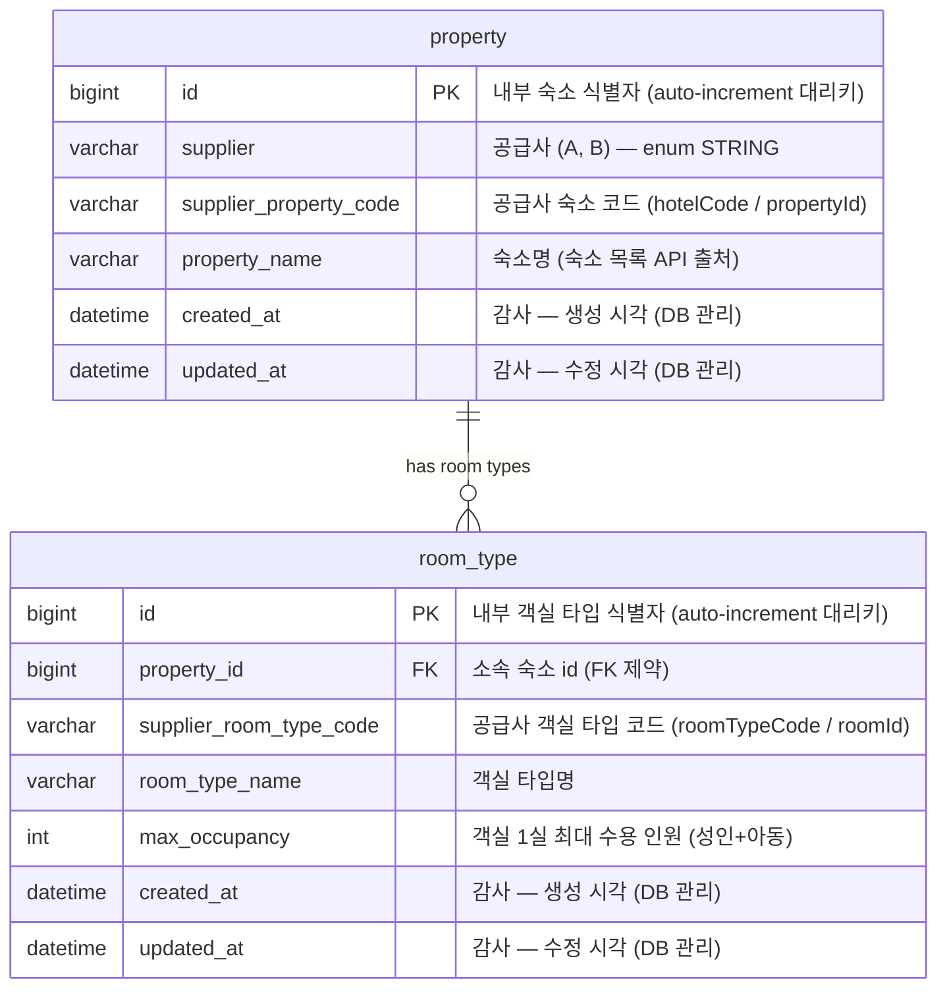

# ERD — 영속 스키마

## 무엇을 저장하고, 무엇을 저장하지 않는가

요금과 재고의 원본은 외부 공급사에 있고 호출할 때마다 값이 바뀌므로 저장하지 않습니다. DB에 남기는 것은
자주 바뀌지 않는 **공급사 코드 ↔ 내부 식별자 매핑**뿐입니다. 이 매핑은 편의가 아니라 조회의 전제입니다 —
공급사의 재고·요금 API는 지역 검색을 지원하지 않고 숙소 코드 목록을 받아 조회하므로, 어떤 숙소를 물어볼지
우리가 먼저 알고 있어야 합니다.



## 제약과 근거

### `property`

- **PK `id`** — 자동 증가 대리키입니다. 공급사 코드를 내부 식별자에 그대로 노출하지 않기 위한 경계입니다.
- **UNIQUE `(supplier, supplier_property_code)`** (`uk_property_supplier_code`) — 숙소 식별자는 "공급사
  안에서만 유일"하므로 공급사와 코드를 함께 묶어야 유일해집니다. 이 제약이 "같은 공급사 상품은 항상 같은
  내부 id로 돌아온다"를 DB 수준에서 보장합니다. 매핑 생성은 `findBy(supplier, code)` 후 없으면 insert하는
  멱등 upsert입니다.

### `room_type`

- **PK `id`** — 동일하게 대리키입니다.
- **FK `property_id`** (`fk_room_type_property`) — 소속 숙소를 가리키며 FK 제약으로 참조 무결성을
  보장합니다. 엔티티에서는 `@ManyToOne(fetch = LAZY)` 연관으로 두되, 조회 시 부모의 `id`만 읽으므로(LAZY
  프록시를 초기화하지 않음) 연관 그래프 로딩이나 N+1이 발생하지 않습니다.
- **UNIQUE `(property_id, supplier_room_type_code)`** (`uk_room_type_property_code`) — 객실 타입 코드는
  "해당 숙소 안에서만 유일"하므로(다른 숙소에 같은 코드가 존재할 수 있음) 숙소와 묶어야 유일해집니다.
  자연키 `(공급사, 숙소 코드, 객실 코드)`를 `property_id`로 축약한 형태입니다. 선행 컬럼이
  `property_id`라서 숙소별 객실 타입 조회도 이 인덱스로 커버됩니다.

### 감사 컬럼 (BaseTimeEntity)

두 테이블 모두 `BaseTimeEntity`(@MappedSuperclass)를 상속합니다. `created_at`/`updated_at`은
애플리케이션이 아니라 **DB가 관리**합니다.

```sql
created_at datetime default current_timestamp
updated_at datetime default current_timestamp on update current_timestamp
```

타입은 `DATETIME`입니다 — MySQL의 `TIMESTAMP`는 32비트 epoch 기반이라 2038-01-19(UTC)까지만 표현할 수
있는 반면, `DATETIME`은 9999년까지 지원합니다. `DEFAULT CURRENT_TIMESTAMP`와 `ON UPDATE
CURRENT_TIMESTAMP`는 `DATETIME`에서도 동일하게 동작합니다. 대신 `DATETIME`은 세션 시간대에 따른 변환 없이
쓴 값을 그대로 저장하므로, **애플리케이션과 DB의 시간대를 KST(Asia/Seoul)로 고정**하는 것이 전제입니다.
정밀도는 초 단위로 충분해 소수점(fractional seconds)은 두지 않습니다.

애플리케이션은 이 컬럼에 값을 쓰지 않습니다(insert 컬럼 목록에서 제외, Hibernate `@Generated`). 매핑은
배치로 갱신되는 정적 데이터라 "언제 마지막으로 동기화됐는지"를 운영에서 추적할 수 있어야 하기 때문에 감사
컬럼을 둡니다.

## 저장하지 않는 것 — 런타임 표준 모델

검색 응답의 표준 모델(`StayProduct`와 그 안의 `price`)은 매 조회마다 어댑터 응답을 정규화해 만들며 영속화하지
않습니다. 구조는 [DOMAIN_MODEL.md](DOMAIN_MODEL.md)를 참고하세요. `propertyId`/`roomTypeId` 필드에는 위
매핑 테이블의 `id`가 채워져 내려갑니다.
